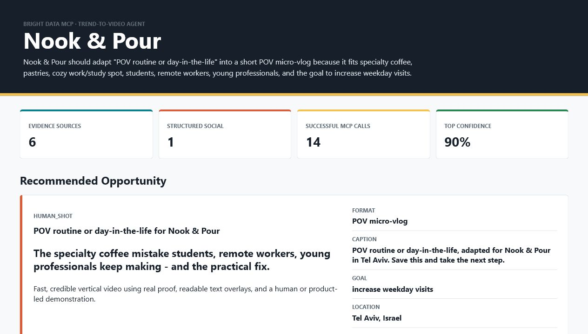

# Bright Data Trend-to-Video Agent

[](https://github.com/arikshvarts/bright-data-agentic-assignment/actions/workflows/ci.yml)

**Bright Data AI Engineer assignment submission:** a location-aware agent that turns live TikTok and web evidence into a ranked content opportunity, production-ready short-video concept, and auditable evidence dashboard.

> A business profile goes in. Current trend evidence, a creative decision, and a shootable video plan come out.



## Submission At A Glance

| Mission | Deliverable | Start here |
| --- | --- | --- |
| **Mission 1** | Trend-to-Video Agent using Bright Data MCP | [`agent-2-trend-video-agent/`](agent-2-trend-video-agent/) |
| **Mission 2** | Firecrawl competitor memo and 90-day Bright Data bet | [`part-2-competitor-memo.md`](part-2-competitor-memo.md) |
| Validation | Exact implementation, failures, live tests, and limits | [`docs/AGENT_2_IMPLEMENTATION_VALIDATION_2026-06-18.md`](docs/AGENT_2_IMPLEMENTATION_VALIDATION_2026-06-18.md) |
| Reviewer guide | Requirement mapping and submission checks | [`docs/ASSIGNMENT_GUIDELINE_AUDIT.md`](docs/ASSIGNMENT_GUIDELINE_AUDIT.md) |

The earlier Agent Ecosystem Opportunity Radar is preserved in [`part-1-agent/`](part-1-agent/) as an alternative Mission 1 concept. Agent 2 is the recommended evaluation path.

## Why This Agent

Generic trend lists are easy to produce and hard to trust. This agent instead asks:

- Is the trend supported by current, inspectable evidence?
- Does it fit the business, audience, location, language, and goal?
- Can this team realistically produce it?
- Is the signal rising, saturated, weak, or only a snapshot?
- What exactly should be filmed, written, and published?

The final output includes ranked trends, evidence links, uncertainty notes, one recommended opportunity, hook, caption, storyboard, shot list, production mode, and a future video-pipeline payload.

## Bright Data MCP Composition

The default live run composes four Bright Data tools:

| Tool | Role |
| --- | --- |
| `search_engine` | Geo-targeted broad discovery |
| `discover` | Country/language-aware intent ranking |
| `scrape_as_markdown` | Evidence extraction and accessibility testing |
| `web_data_tiktok_posts` | Structured captions, creator data, dates, metrics, hashtags, and video URLs |

Deep mode also uses `web_data_tiktok_comments` for audience language and objections.

Tool usage is derived from real execution telemetry, not hardcoded into the report.

## Architecture


## Run The Recommended Demo

Requirements: Node.js 20+, a Bright Data API token, and either an Anthropic or OpenAI key.

```powershell
cd agent-2-trend-video-agent
npm install
Copy-Item .env.example .env
# Add BRIGHT_DATA_API_TOKEN and ANTHROPIC_API_KEY or OPENAI_API_KEY
npm run demo:live
```

Outputs are written to `agent-2-trend-video-agent/runs/`:

- Console decision summary
- Markdown report
- Machine-readable JSON
- Responsive HTML evidence dashboard

Additional live profiles:

```powershell
npm run demo:fitness
npm run demo:b2b
```

Deep TikTok post and comment enrichment:

```powershell
npm run demo:deep-social
```

The deep run is intentionally slower because Bright Data structured datasets are collected asynchronously.

## Evidence And Failure Handling

Failure behavior was driven by issues encountered during live development:

- MCP errors returned as `isError` results instead of thrown exceptions
- Invalid Discover city targeting
- TikTok pages with little public scrapeable text
- Search snippets contradicted by structured TikTok captions
- Evidence sets consisting only of thin metadata
- Malformed Anthropic JSON
- Cross-profile region contamination
- False velocity caused by comparing incompatible scoring versions

The agent records MCP status, duration, result count, sanitized errors, scrape state, relevance tier, independent-source count, and the explicit basis for velocity and saturation.

It refuses to produce a report when fewer than three sources or insufficient weighted evidence remain.

## Verified Results

| Check | Result |
| --- | --- |
| TypeScript typecheck | Passed |
| Unit and mocked E2E tests | **19 passed across 12 files** |
| Production build | Passed |
| Dependency audit | **0 vulnerabilities** |
| Live cafe profile | Passed |
| Live fitness profile | Passed |
| Live B2B profile | Passed |
| Structured TikTok posts | Passed live |
| Structured TikTok comments | Passed live in deep mode |
| Desktop/mobile dashboard QA | Passed |

GitHub Actions repeats typecheck, tests, build, and dependency audit for both runnable agent packages.

## Sample Output

- [Readable report](agent-2-trend-video-agent/runs/sample-report.md)
- [Structured JSON](agent-2-trend-video-agent/runs/sample-report.json)
- [HTML dashboard source](agent-2-trend-video-agent/runs/sample-dashboard.html)

The committed sample includes six evidence sources, four ranked opportunities, structured TikTok metrics, 14 recorded MCP calls, and no embedded credentials.

## Repository Map

```text
.
|-- agent-2-trend-video-agent/   # Recommended Mission 1 implementation
|-- part-1-agent/                # Preserved alternative Mission 1 agent
|-- agent-1-ecosystem-radar/     # Archive of the original Agent 1 package
|-- docs/                        # Architecture, validation, comparison, evaluation
|-- part-2-competitor-memo.md    # Mission 2 leadership memo
`-- .github/workflows/ci.yml     # Automated repository verification
```

## Design Tradeoff

The fast demo prioritizes reproducibility and reviewer time: Rapid discovery plus one structured TikTok post. Deep mode adds post and comment datasets, but takes longer.

Velocity is deliberately conservative. Historical claims require version-compatible reports separated by at least 12 hours; otherwise the report says `unknown` or clearly labels a structured engagement estimate as a snapshot.

## Documentation

All detailed writeups are indexed in [`docs/README.md`](docs/README.md), including:

- Requirement-by-requirement audit
- Source-quality validation
- Agent 1 versus Agent 2 comparison
- Bright Data social-data upgrade path
- Full implementation and live-test record
- Part 2 memo reasoning

## Future Extension

The JSON output includes `futureVideoPipelineDraft`, designed for a later MoneyPrinterTurbo-style integration:

```text
trend evidence -> creative brief -> script -> scenes -> assets -> rendered short video
```

Video rendering is intentionally outside this MVP so the assignment remains focused on live-web evidence, agent reasoning, and production-quality failure handling.
